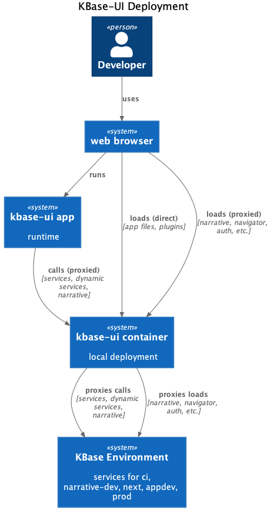

# Local Deployment

This section describes how a production image is deployed locally.

## Prerequisites

Make sure you have the following available:

- make
- docker

## Overview

The production image is self-contained, but does need to run behind a proxy. Well, it _could_ run by itself, but kbase-ui is integrated into other KBase interfaces and services in such a manner that it is much easier to run when integrated.

This integration takes the form of a proxy, which simulates the proxy KBase uses in each deployment environment.

The proxy handles:

- routing to https://ci.kbase.us/services for any request to /services (core services)
- routing to https://ci.kbase.us/dynserv for any requests to /dynserv (dynamic services)
- routing to https://ci.kbase.us/narrative (including websockets) for any requests to /narrative
- routing to https://ci.kbase.us/narratives for any requests to /narratives (Narratives Navigator)
- special handling for prod (since prod operates on two hosts)

The proxy defaults to CI, but can be configured on the command line to proxy to narrative-dev, next, appdev, or prod.



## Quick Start

A local deployment may be started with a simple command line invocation:

```shell
make local-server
```

This will:

- build kbase-ui (see [local build](./local-build.md)
- create the kbase-ui image
- ensure the docker network `kbase-dev` exists
- create a docker compose override file
- start kbase-ui and the proxy with docker compose

Let's dig in a little deeper (we'll skip the first two -- see [local build](./local-build.md))

## ensure the docker network `kbase-dev` exists

The local kbase-ui container and proxy operate on the same external docker network named `kbase-dev`. Generally this is done to be able to easily and reliably operate different pieces of local deployment on the same docker network. Within the same docker network, docker compose services (running containers) will be automatically available under their host names. This eases communciation between services.

In the simplest case, this allows the kbase-ui front end (nginx) to be proxied internally by the kbase-ui local proxy.

kbase-ui may also be used as a front end for narrative and navigator, easing development of those products since they may use kbase-ui for login, logout, and navigation.

In additional, local instances of plugins, core and dynamic services may be proxied to, allowing co-development of these products in an integrated manner.

## create a docker compose override file

[ to do ]

## start kbase-ui and the proxy with docker compose

[ to do ]