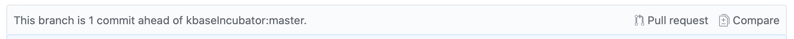
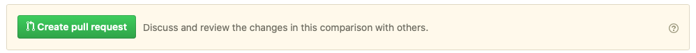
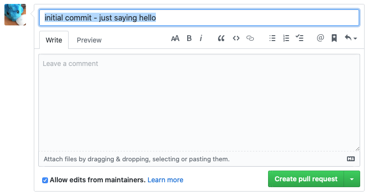
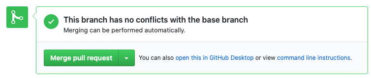
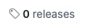
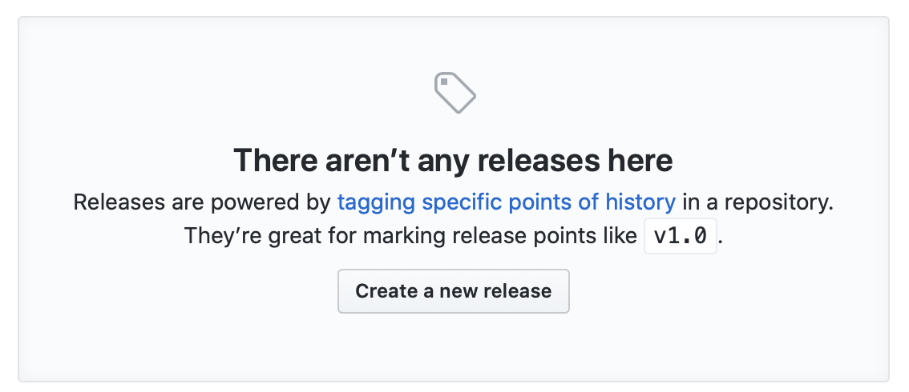
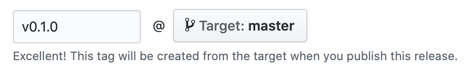
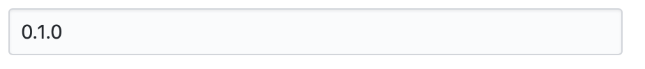

# Step 8: Add To KBase UI

1. add to plugins.yml

    The kbase-ui configuration file `plugins.yml` located in the `config` directory (of the kbase-ui repo!) lists all kbase-ui plugins which will be included in the kbase-ui build.

    All plugins are contained in a list underneath the `plugins` top level property. Each plugin is represented by a list item:

    ```yaml
    - name: example-hello
      globalName: kbase-ui-plugin-example-hello
      version: 0.1.0
      cwd: plugin
      source:
          git:
            account: kbaseIncubator
    ```

2. Note that our plugin has a version! But this configuration won't work unless we actually create a release version `0.1.0`.

     - Pull up your plugin repo at github.

     - Issue a pull request to the upstream repo:

        - notice the line indicating that you can issue a pull request:

        

        - click the Pull Request button

        - Click the Create Pull Request button

        

        - Not done yet! On the create pull request form, enter a note, any description necessary, and click Create pull request, again.

        


       - Still not done! Normally you would ask someone to review the Pull Request and merge it, but in this case you'll do it yourself. Click the Merge pull request button.

        

       - Not done? And now confirm it by clicking the Confirm Merge button

        
  
     - Pull up the repos github home page by clicking on the repo name in the page title.

     - Click the releases "tab" 

     - Click the "Create a new release" button 


     - In the first field, labeled "Tag version", enter `v0.1.0`

       

       - this is the release tag, and should follow this format:
         - starts with the letter `v`
         - followed by a semantic version

       - note that the version starts with `0.1.0`. This indicates the first development version, with no patches. A major version of `0` should always indicate a development version. Special rules apply to development versions, compared to release versions (major version is `1` or above).

     - In the second field, labeled "Release title", enter `0.1.0`.

       

     - The description field is optional.

     - click the Publish Release button.

       

3. Build the ui

    ```bash
    make dev-cert
    make dev-start env=dev build=dev build-image=t
    ```

4. Rewire CI host

    - edit `/etc/hosts`

    - add the following line:

      ```bash
      127.0.0.1   ci.kbase.us
      ```

5. Pull up the ui in your browser at `https://ci.kbase.us`.

6. Iterating on plugin

    - Start the ui with:

      ```bash
      make dev-start env=dev build=dev build-image=f plugins="my-plugin"
      ```

    - After changes to the plugin, you will need to do a full build. From the top level of the repo:

      ```bash
      npm install
      ```

    - This installs top level dependencies (not necessary here) and more importantly runs the post install script, which both builds the plugin and moves it into the correct location for the ui.

7. Add to ui menu:

    > to be written

## Next Step

[Step 9. Add Testing](./9-add-testing)

\---
