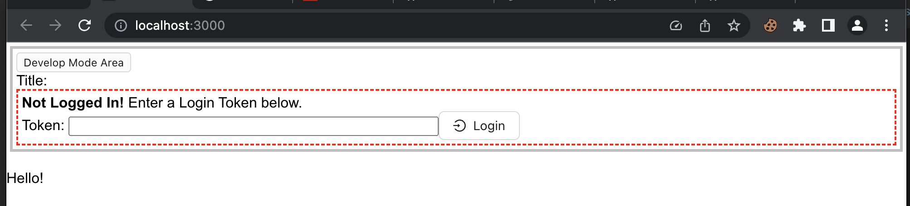
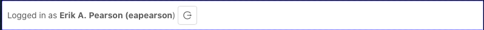

# Step 6. Setup as Plugin

So far we have managed to create a simple CRA-based web app, with a few tweaks. Now we will install the machinery needed to run this web app as a kbase-ui plugin.

1. Set the target JS language

    By default a CRA app is configured to target ES5. This gives the broadest browser coverage. However, since we already require ES6 browser compatibility, the generated code will be more compact and understandable if we target ES6.

    Edit `react-app/tsconfig.json` to set the property `compilerOptions.target` to `"ES6"`.

2. Set the homepage property

    By default the CRA does not set the `"homepage"` property. The default behavior does not work well for our app, since it assumes the app path is at the url root `/`. The plugin react app will operate at a url path that looks like `/modules/plugins/PLUGIN/iframe_root`. We don't want to hard-code that value in our app, if we can.

    What we can do is set the homepage property to `./`.

    Edit the file `react-app/package.json` to add the top level property:

    ```json
    "homepage": "./",
    ```

3. Set up Proxy

    For local development with `npm run start`, let's make the built-in proxy work with KBase's CI environment. This will proxy requests from `http://localhost:3000` (or wherever the local dev server is running, this is the default url) to `https://ci.kbase.us`.

    Add the `proxy` property to `package.json` like so:

    ```json
    "proxy": "https://ci.kbase.us"
    ```

    You may proxy this development server to any KBase environment, such as production, simply by changing the proxy url. However, in normal practice we proxy against CI in order to avoid potential disruption those environments.

    > TODO: We now support proxying against any deployment environment via the command line using a more advanced proxying configuration...

    > TODO: add chapter on advanced proxying...

4. Set up the KBase integration dependency

    Integration into kbase-ui depends on two KBase npm packages.

     - Quit the tests

    - Install the _kbase-ui-lib_ package. This package contains general support for working with KBase, including service libraries.

      ```bash
      npm install -E @kbase/ui-lib 
      ```

    - Install the _kbase-ui-components_ package. This package contains component-specific support, plugin component support, as well as custom KBase components.

        ```bash
        npm install -E @kbase/ui-components
        ```

5. Fix new dependency

    After installing any new dependencies, it is a good idea to update `package.json` to ensure that the dependency version expressions are absolute. We do that by editing `package.json`.

    - edit `package.json`
    - note the new dependencies:

      ```json
      "@kbase/ui-lib": "x.y.z",
      "@kbase/ui-components": "x.y.z",
      ```

      where `x.y.z` is the current version of `@kbase/ui-lib`.

    - fix other dependencies

      Note that other dependency version have a caret character `^` prefix. 

      The `^` prefix to the dependency versions means that npm is allowed to install the most recent version of the package with the same major version number. Thus a version expression of `^1.0.0` may result in version `1.5.13` being installed.

      We would rather our builds be deterministic and repeatable, so we want to simply remove the `^` prefix. npm will have installed the most recent versions of the packages, so we don't have to inspect the versions to ensure we have the most recent one.

      The `-E` option used in our commands will ensure that new dependency versions are recorded exactly in package.json

6. Install redux:

    The KBase integration requires the usage of Redux in the react app. Even if you don't intend on using it for the plugin, the integration requires the usage of Redux as the storage location for the kbase-ui integration.

    - install redux packages

      ```bash
      npm install -E redux react-redux @types/react-redux redux-thunk
      ```

7. Create redux implementation files

    First we'll put the redux pieces in place, without any functionality. In this step we are going to create files with this structure:

    ```text
    src
    	redux
        actions.ts
        reducers.ts
        store.ts
    ```

    - create the top level `redux` directory within `react-app/src`.

      ```bash
      mkdir redux
      ```

    - within `redux`, create `actions.ts` with the following code

    - > Actually, rules have changed since this was written, and the actions.ts file will need to be saved without formatting (you can find it in the command palette.)

      ```typescript
      import { Action } from "redux";
      ```

    - within `redux`, create `store.ts` with the following code.

      ```typescript
      import { BaseStoreState, makeBaseStoreState } from "@kbase/ui-components";
      import { createStore, compose, applyMiddleware } from "redux";
      import thunk from "redux-thunk";
      import reducer from "./reducers";

      export interface StoreState extends BaseStoreState {}

      export function makeInitialStoreState(): StoreState {
        const baseStoreState = makeBaseStoreState();
        return {
          ...baseStoreState
        };
      }

      export function createReduxStore() {
        return createStore(reducer, makeInitialStoreState(), compose(applyMiddleware(thunk)));
      }
      ```

    - within `redux`, create `reducers.ts` with the following code

      ```typescript
      import { baseReducer, BaseStoreState } from "@kbase/ui-components";
      import { StoreState } from "./store";
      import { Action, Reducer } from "redux";
      
      const reducer: Reducer<StoreState | undefined, Action> = (state: StoreState | undefined, action: Action) => {
        const baseState = baseReducer(state as BaseStoreState, action);
        if (baseState) {
          return baseState as StoreState;
        }
        return state;
      };
      
      export default reducer;
      ```

8. Add integration component to `App.tsx`

    Now that redux is set up, including integration into the core kbase-ui integration, we need to add a special integration component to our app to active it.

    - update `App.tsx` so that it looks like this:

      ```tsx
      import { AppBase } from "@kbase/ui-components";
      import { Component } from "react";
      import { Provider } from "react-redux";
      import "./App.css";
      import { createReduxStore } from "./redux/store";

      const store = createReduxStore();

      interface AppProps {}

      interface AppState {}

      export default class App<AppProps, AppState> extends Component {
        render() {
          return (
            <Provider store={store}>
                <AppBase>
                  <div className="App">
                    <p>Hello!</p>
                  </div>
                </AppBase>
            </Provider>
          );
        }
      }
      ```

    - note the updates:
      - we added two new imports for `Provider` and `createReduxStore`
      - we used `createReduxStore` to create our initial redux store, which is stored in the top level App component's namespace.
      - we wrapped our app content in a `Provider` component, which ensures that our app has access to redux.
      - we added developer and kbase integration support with `AppBase` which were imported and then added as wrapper components around our app.

9. Test it

After a major set of changes like this, it is prudent to run the tests, and to exercise the web app, to ensure we didn't introduce bugs.
    
    ```bash
    npm run test
    ```

The first thing you may notice is that the app now takes longer to compile. We've added a bunch more code, and Typescript compilation and the bundling process can slow down quite a bit when more code is added.

The second notable event is that the test no longer passes!

This is because our app is now nested inside the kbase integration layer, which asynchronously integrates with kbase-ui. Thus the `<App />` component is not loaded synchronously, and the expected `Hello!` text is not present immediately after the component is created.

To fix this, alter the contents of `App.test.tsx` to:
    


```typescript
import { render, screen, waitFor } from '@testing-library/react';
import App from './App';

test('renders App', async () => {
    render(<App />);

    await waitFor(() => {
        const linkElement = screen.getByText(/Hello!/i);
        expect(linkElement).toBeInTheDocument();
    });
});
```


Note that we've moved the code which performs the inspection of the DOM to look for the required content into a function provided to `waitFor()`. The waitFor function will repeatedly run that function if the expectation fails, for up to 4.5 (TODO: check this -- don't know if still true) seconds. If the expectation does not succeed by the end of that interval, the test fails.


> See: [Testing Library Docs](https://testing-library.com/docs/dom-testing-library/api-async)
> 

After saving these changes, the test should run again, and pass.

10. Run the app

    ```bash
    npm run start
    ```

    > TODO: If kbase-ui is still running, we are all fine. If not, then the proxy will be down, and we should comment out ci.kbase.us in the etc/hosts.

    The first thing you should notice is that instead of "Hello" and "Hi!", you now are confronted with a dialog box

    

    This is the "Developer Login Form". Essentially it allows you to add a KBase auth cookie to the browser, and, once the cookie is set, remove it.

    To proceed to the App, you should enter a CI login token into the **Token:** field and click the **Login** button.

    You should now see the token user's real and user name displayed, and a logout button:

    


## References

- https://redux.js.org/recipes/migrating-to-redux

## Next Step

[Step 7. Plugin Packaging](./7-plugin-packaging)

\---
