# Workflows

Of the 9 workflow files comprising the GHA support, 3 are [_reusable workflows_](https://docs.github.com/en/enterprise-cloud@latest/actions/using-workflows/reusing-workflows) containing the primary workflow logic, and 7 are _controlling workflows_ (my term) which invoke reusable workflows and are triggered by specific conditions.

> GitHub Actions supports a type of workflow termed a [_reusable workflow_](https://docs.github.com/en/enterprise-cloud@latest/actions/using-workflows/reusing-workflows). Such workflows may only be run by being included in another workflow. They differ from a normal workflow in that they can only use a special triggering condition `on.workflow_call`, and they may define a set of input parameters.

## Reusable Workflows

### `reusable_test.yml`

This workflow will run the tests defined for the repo. Although the steps in the workflow are not specific to kbase-ui, the implementation within the Makefile certainly is.

- check out repo
- DESCRIBE STEPS HERE
- set up tests via `make test-setup`
- run tests via `make test`
- produce a coverage summary report for easy inspection in the GHA log
- send coverage data to CodeCov

#### inputs

none

#### outputs

none

### `reusable_validate-release-tag.yml` 

This is a simple workflow whose purpose is to ensure that a release tag is in compliance with the expected form. At present that form is the basic semantic version format `#.#.#`. The string is passed in as the input `release_tag`. The workflow will fail (exit with error code 1) if the release tag is not compliant. This prevents a release with a non-compliant tag.

The workflow is implemented in Javascript.

#### inputs

- `release_tag` - the tag used for the release

#### outputs

_none_

#### effects

Will exit the controlling workflow if validation fails

### `reusable_build.yml`

This workflow builds an image from the project's primary Dockerfile. This is useful for including in workflows which need to prove that a service image can be built successfully, but in which the image is not needed, and thus does not need to be stored.

#### inputs

_none_

#### outputs

_none_ 

#### effects

Will exit the controlling workflow if the build fails

### `reusable_build-push.yml`

This workflow captures the process of building the service image and pushing the resulting image to GitHub Container Registry (GCHR) with a given tag. It primarily uses standard, commonly used third party workflows from GitHub and Docker, in addition to custom scripts.

- check out repo
- get and save current date as a timestamp
- setup the build
- log into GHCR with standard secrets
- create tags appropriate usage in next step
- build and push image
  - build image
  - push the image to GHCR with a given name and one or more tags

#### inputs

- `name` - the image name
- `tags` - the image tags; a string, using a comma (`,`) as a list separator

#### outputs

_none_

#### effects

- saves image to GHCR
- will exit the controlling workflow if the build fails, login fails, push fails

## Controlling Workflows

Note that in the diagrams below, only major events are shown. For example, there are numerous additional possible error conditions, but only the most common and interesting ones are shown.

### `push-to-feature-fix.yml`  
   
triggered by `push` to a branch prefixed with `feature-` or `fix-`, so-called feature and fix branches. It runs both test and image build/push, and a tag which is the branch name. It supports the use case iterating on a feature of fix branch, and possibly needing to review the image in a deployment. 

```mermaid
sequenceDiagram
    actor Developer
    participant GH as GitHub UI 
    participant GHS as GitHub System
    participant Workflow as Controlling Workflow 
    participant TestWorkflow as Reusable Test Workflow 
    participant BuildWorkflow as Reusable Build/Push Workflow
    participant GHCR as GitHub Container Registry
    participant CodeCov
    
    Developer ->> GHS: Push up feature branch (feature-X)
    GHS ->> GHS: emits event (push to feature-X)
    
    GHS ->> Workflow: Runs (if event matches)
    
    activate Workflow
    
    Workflow ->> TestWorkflow: Runs
    activate TestWorkflow
    
    rect rgb(38, 103, 138)
    note over Developer,CodeCov: Testing
    
    TestWorkflow ->> Workflow : if any test fails (exit with error)
    Workflow ->> GH: if exit with error (terminate workflow)
    GH ->> Developer: show error
    TestWorkflow ->> CodeCov: sends coverage
    TestWorkflow ->> Workflow: success
    deactivate TestWorkflow
    
    end
    
    Workflow ->> BuildWorkflow: Runs
    
    rect rgb(15, 98, 72)
    note over Developer,CodeCov: Build and Push Image
    
    activate BuildWorkflow
    BuildWorkflow ->> BuildWorkflow: build image
    BuildWorkflow ->> Workflow: if build fails (exit with error)
    Workflow ->> GH: if exit with error (terminate workflow)
    GH ->> Developer: show error
    
    BuildWorkflow ->> GHCR: Login (GHCR_USERNAME, GHCR_TOKEN)
    BuildWorkflow ->> Workflow: if login fails (exit with error)
    Workflow ->> GH: if exit with error (terminate workflow)
    GH ->> Developer: show error
    
    BuildWorkflow ->> GHCR: push image (kbase-ui:feature-X)
    BuildWorkflow ->> Workflow:success
    
    deactivate BuildWorkflow
    
    Workflow ->> GH: success
    
    end
    
    deactivate Workflow
    GH ->> Developer: show success
```

### `pull-request-main-opened.yml`  
   
Triggered by opening a pull request (`opened` event)  against the `main` (or legacy `master`) branch. This workflow  creates an image with name `kbase-ui` and a tag like `pr#`, where `#` is the pull request number.

```mermaid
sequenceDiagram
    actor Developer
    participant GH as GitHub UI 
    participant Workflow as Controlling Workflow 
    participant TestWorkflow as Reusable Test Workflow 
    participant BuildWorkflow as Reusable Build/Push Workflow
    participant GHCR as GitHub Container Registry
    participant CodeCov
    
    Developer ->> GH: Create PR from develop to main 
    GH ->> GH: emits event (pull_request opened)
    
    GH ->> Workflow: Runs (if event matches and merged)
    
    activate Workflow
    
    Workflow ->> TestWorkflow: Runs
    activate TestWorkflow
    
    rect rgb(38, 103, 138)
    note over Developer,CodeCov: Testing
    
    TestWorkflow ->> Workflow : if any test fails (exit with error)
    Workflow ->> GH: if exit with error (terminate workflow)
    GH ->> Developer: show error
    TestWorkflow ->> CodeCov: sends coverage
    TestWorkflow ->> Workflow: success
    deactivate TestWorkflow
    
    end
    
    Workflow ->> BuildWorkflow: Runs
    
    rect rgb(15, 98, 72)
    note over Developer,CodeCov: Build and Push Image
    
    activate BuildWorkflow
    BuildWorkflow ->> BuildWorkflow: build image
    BuildWorkflow ->> Workflow: if build fails (exit with error)
    Workflow ->> GH: if exit with error (terminate workflow)
    GH ->> Developer: show error
    
    BuildWorkflow ->> GHCR: Login (GHCR_USERNAME, GHCR_TOKEN)
    BuildWorkflow ->> Workflow: if login fails (exit with error)
    Workflow ->> GH: if exit with error (terminate workflow)
    GH ->> Developer: show error
    
    BuildWorkflow ->> GHCR: push image (kbase-ui:pr#)
    BuildWorkflow ->> Workflow:success
    
    deactivate BuildWorkflow
    
    Workflow ->> GH: success
    
    end
    
    deactivate Workflow
    GH ->> Developer: show success
```

### `pull-request-main-merged.yml`  
   
Triggered by closing and merging a pull request against the `main` (or legacy `master`) branch. This workflow  creates an image with name `kbase-ui` and the tag `latest-rc`.

```mermaid
sequenceDiagram
    actor Developer
    participant GH as GitHub UI 
    participant Workflow as Controlling Workflow 
    participant TestWorkflow as Reusable Test Workflow 
    participant BuildWorkflow as Reusable Build/Push Workflow
    participant GHCR as GitHub Container Registry
    participant CodeCov
    
    Developer ->> GH: Pull request from develop to main merged
    GH ->> GH: emits event (pull_request opened)
    
    GH ->> Workflow: Runs (if event matches and merged)
    
    activate Workflow
    
    Workflow ->> TestWorkflow: Runs
    activate TestWorkflow
    
    rect rgb(38, 103, 138)
    note over Developer,CodeCov: Testing
    
    TestWorkflow ->> Workflow : if any test fails (exit with error)
    Workflow ->> GH: if exit with error (terminate workflow)
    GH ->> Developer: show error
    TestWorkflow ->> CodeCov: sends coverage
    TestWorkflow ->> Workflow: success
    deactivate TestWorkflow
    
    end
    
    Workflow ->> BuildWorkflow: Runs
    
    rect rgb(15, 98, 72)
    note over Developer,CodeCov: Build and Push Image
    
    activate BuildWorkflow
    BuildWorkflow ->> BuildWorkflow: build image
    BuildWorkflow ->> Workflow: if build fails (exit with error)
    Workflow ->> GH: if exit with error (terminate workflow)
    GH ->> Developer: show error
    
    BuildWorkflow ->> GHCR: Login (GHCR_USERNAME, GHCR_TOKEN)
    BuildWorkflow ->> Workflow: if login fails (exit with error)
    Workflow ->> GH: if exit with error (terminate workflow)
    GH ->> Developer: show error
    
    BuildWorkflow ->> GHCR: push image (kbase-ui:latest-rc)
    BuildWorkflow ->> Workflow:success
    
    deactivate BuildWorkflow
    
    Workflow ->> GH: success
    
    end
    
    deactivate Workflow
    GH ->> Developer: show success
```

### `release-main`  
   
Triggered by the creation (`published` event) of a GitHub release against the `main` (or legacy `master`) branch. This workflow creates an image with the name `kbase-ui` and applies two tags - the release tag, which is typically a semver `#.#.#`, and `latest-rc`

```mermaid
sequenceDiagram
    actor Developer
    participant GH as GitHub UI 
    participant Workflow as Controlling Workflow 
    participant TestWorkflow as Reusable Test Workflow 
    participant BuildWorkflow as Reusable Build/Push Workflow
    participant GHCR as GitHub Container Registry
    participant CodeCov
    
    Developer ->> GH: Create Release x.y.z against main
    GH ->> GH: emits event (release published)
    
    GH ->> Workflow: Runs (if event matches and merged)
    
    activate Workflow
    
    Workflow ->> TestWorkflow: Runs
    activate TestWorkflow
    
    rect rgb(38, 103, 138)
    note over Developer,CodeCov: Testing
    
    TestWorkflow ->> Workflow : if any test fails (exit with error)
    Workflow ->> GH: if exit with error (terminate workflow)
    GH ->> Developer: show error
    TestWorkflow ->> CodeCov: sends coverage
    TestWorkflow ->> Workflow: success
    deactivate TestWorkflow
    
    end
    
    Workflow ->> BuildWorkflow: Runs
    
    rect rgb(15, 98, 72)
    note over Developer,CodeCov: Build and Push Image
    
    activate BuildWorkflow
    BuildWorkflow ->> BuildWorkflow: build image
    BuildWorkflow ->> Workflow: if build fails (exit with error)
    Workflow ->> GH: if exit with error (terminate workflow)
    GH ->> Developer: show error
    
    BuildWorkflow ->> GHCR: Login (GHCR_USERNAME, GHCR_TOKEN)
    BuildWorkflow ->> Workflow: if login fails (exit with error)
    Workflow ->> GH: if exit with error (terminate workflow)
    GH ->> Developer: show error
    
    BuildWorkflow ->> GHCR: push image (kbase-ui:x.y.z)
    BuildWorkflow ->> Workflow:success
    
    deactivate BuildWorkflow
    
    Workflow ->> GH: success
    
    end
    
    deactivate Workflow
    GH ->> Developer: show success
```

### `manual.yml`  
   
triggered by `workflow_dispatch`, so can be run by the GitHub UI button. It runs both test and image build/push, and a tag which is the branch name prefixed with `br-`. The supports the use case of generating an image from any branch. E.g. in order to preview changes in a feature or fix branch, one may run this workflow specifying a branch which is either the source for a PR or may become one, generating an image that may be previewed and verifying through shared test results that the changes are non-breaking.

```mermaid
sequenceDiagram
    actor Developer
    participant GH as GitHub UI 
    participant Workflow as Controlling Workflow 
    participant TestWorkflow as Reusable Test Workflow 
    participant BuildWorkflow as Reusable Build/Push Workflow
    participant GHCR as GitHub Container Registry
    participant CodeCov
    
    Developer ->> GH: Press "Run workflow" button, select branch BRANCH
    GH ->> GH: emits event (workflow_dispatch)
    
    GH ->> Workflow: Runs (if event matches)
    
    activate Workflow
    
    Workflow ->> TestWorkflow: Runs
    activate TestWorkflow
    
    rect rgb(38, 103, 138)
    note over Developer,CodeCov: Testing
    
    TestWorkflow ->> Workflow : if any test fails (exit with error)
    Workflow ->> GH: if exit with error (terminate workflow)
    GH ->> Developer: show error
    TestWorkflow ->> CodeCov: sends coverage
    TestWorkflow ->> Workflow: success
    deactivate TestWorkflow
    
    end
    
    Workflow ->> BuildWorkflow: Runs
    
    rect rgb(15, 98, 72)
    note over Developer,CodeCov: Build and Push Image
    
    activate BuildWorkflow
    BuildWorkflow ->> BuildWorkflow: build image
    BuildWorkflow ->> Workflow: if build fails (exit with error)
    Workflow ->> GH: if exit with error (terminate workflow)
    GH ->> Developer: show error
    
    BuildWorkflow ->> GHCR: Login (GHCR_USERNAME, GHCR_TOKEN)
    BuildWorkflow ->> Workflow: if login fails (exit with error)
    Workflow ->> GH: if exit with error (terminate workflow)
    GH ->> Developer: show error
    
    BuildWorkflow ->> GHCR: push image (kbase-ui:BRANCH)
    BuildWorkflow ->> Workflow:success
    
    deactivate BuildWorkflow
    
    Workflow ->> GH: success
    
    end
    
    deactivate Workflow
    GH ->> Developer: show success
```

