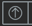

---
---
# Releasing to CI

During the iterative development of a plugin, as well as the final release, it will be released to CI for review.

At present, the process for review release and final release are identical. 

We could entertain using a suffix like `-dev` for the plugin version to signal it should not be released. With such a scheme, we could prohibit the prod build if any plugins are configured for a dev version.

This conflicts, but is compatible, with our principle that kbase-ui should always be releasable from `develop` branch, with minimal effort. That is, no exposed pieces should be left in an intermediate, unfinished state. We utilize feature switches to hide unreleased features by using the enable logic -- the feature enable list is expanded to expose the feature in CI, but hide it in prod.

Another technique would be to simply use a kbase-ui feature branch for "CI" release of unfinished features. kbase-ui will build an image for any commits to a branch prefixed with `feature-`. However, we do not have the capability to easily spin up a new CI nginx server. `narrative-dev` and `narrative-refactor` are two CI servers available for such usage. They can easily be reconfigured to pull a different tagged kbase-ui image. One must be mindful that these servers may already be in use by a project.

## TL;DR

1. Do a fresh build of your plugin, if it hasn't been done already

    ```bash
    yarn build
    ```

2. Push plugin changes to your fork of the plugin
3. Issue a Pull Request against the upstream kbase repo.
4. When the PR is merged, create a release in semver format.
   1. The tag should be in the format `vMAJOR.MINOR.PATCH`, e.g. `v1.2.3`
   2. The comment should be `MAJOR.MINOR.PATCH`, e.g. `1.2.3`
5. In your local kbase-ui, update the version in `plugins.yml` to the version set above.
   1. Note that this version should be in the semver format without the `v` prefix.
6. Conduct a local build, and verify that it pulled in the correct version.

    ```bash
    make dev-start build-image=t
    ```

7. Push up the kbase-ui changes (just the single line of `plugins.yml`) to your fork.
8. Issue a Pull Request against kbase's kbase-ui
9. When the PR is merged, an image will be built and pushed to dockerhub automatically.
   1.This process takes approximately 5-10 minutes
10. The CI kbase-ui deployment now needs to be updated. This is accomplished using rancher.
    1. open an ssh forward to kbase:
       1. e.g `ssh -D 1234 yourusername@login1.berkeley.kbase.us`
       2. You may choose whichever port (1234 above) you prefer.
       3. Log in at the prompt if required to. This will be your kbase developer account password corresponding to `yourusername`.
       4. this ssh forward supports SOCKS
    2. open a browser using this ssl proxy:
       1. e.g. in Firefox
           1. open preferences 
           2. open General > Network Settings > Settings... (at the bottom of the General tab)
           3. Select "Manual proxy configuration"
           4. In "SOCKS" enter "localhost" for "Host", and "1234" (or whatever you supplied on the command line above) for Port.
    3. open the url `https://rancher.berkeley.kbase.us`
    4. sign in with your KBase developer credentials
    5. in the `ci-core` section, locate the row for `kbase-ui` (it will be shown in the second column)
    6. click the Upgrade button, far right, 
    7. Wait for the Rancher ui to indicate the upgrade is complete.
    8. Visit https://ci.kbase.us, and verify that your changes are there and behaving correctly.
    9. Finish the upgrade by clicking on the Upgrade button a second time.
